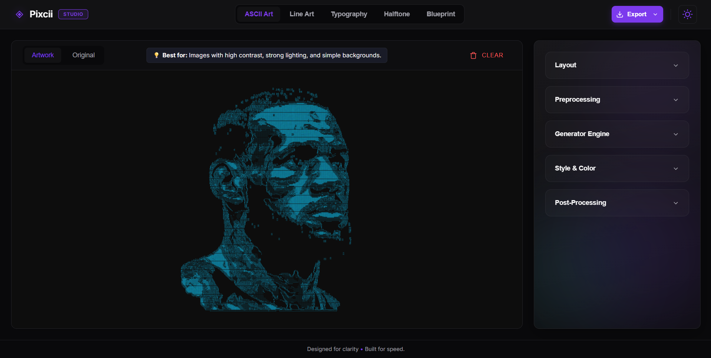

# ◈ Pixcii Studio

**Pixcii Studio** is a premium, high-fidelity generative art platform that runs entirely in your browser. It transforms your photos into stunning ASCII art, Technical Blueprints, Typographic Word Clouds, and Halftone patterns. Built for designers, developers, and digital artists, it focuses on crisp vector/raster outputs, modern aesthetics, and professional-grade performance using Web Workers.

---

## ✨ Generative Engines

### 1. Blueprint & Schematic Mode (NEW)
Turns your images into highly precise technical engineering drawings.
- **Edge Detection**: Uses Sobel operators to extract stark object contours with adjustable threshold and line thickness.
- **Dynamic Elements**: Automatically generates measurement dimension brackets (`W: x`, `H: y`), geometric background grids, and technical crosshairs.
- **Annotation Densities**: Select from None, Minimal, Moderate, Dense, or Extreme plotting logic.
- **Architectural Themes**: Classic (Blueprint Blue), Matrix (Green/Black), Sepia, and Midnight (Dark Purple).

### 2. Canvas Typography Engine
A completely custom, high-resolution packing engine that paints your image using words.
- **Luminance Mapping**: Words dynamically scale and pack based on the darkness of the underlying image regions.
- **Advanced Controls**: Customize the word dictionary, font weight, global spacing, and letter spacing.

### 3. ASCII Art
- Detailed, Smooth, Block, and Terminal algorithms.
- Full control over character ramps and rendering density.

### 4. Line Art & Halftones
- **Line Art**: Minimalist threshold-based edge detection.
- **Halftone Patterns**: Professional dot layouts (Circle/Square) with customizable rotation and density spacing.

---

## 🎨 Global Studio Features

### 1. High-Fidelity Color Studio
- **Precision Picker**: Floating, sidebar-docked HSVA color picker.
- **Gradient Engine**: Support for **Linear** and **Radial** gradients with adjustable angles and color stops.
- **Edge Enhancements & Inversion**: Instantly invert output polarity or outline core structures.

### 2. Post-Processing & Transformations
- **Image Adjustments**: Fine-tune contrast, gamma, sharpness, blur, grain, and hue rotation in real-time.
- **Canvas Control**: Pad, rotate, and horizontally/vertically flip your output for precise layout alignment.

### 3. Persistence & Performance
- **Multi-threaded Generation**: All intensive math and edge-detection operations are offloaded to an isolated Web Worker (`art-worker.js`), ensuring the UI stays buttery smooth.
- **Session Recovery**: Every single slider adjustment, theme preference, and uploaded image is saved automatically to `localStorage`. Refresh your tab anytime without losing your work.
- **Dynamic Pro Tips**: Helpful UI hints adapt instantly to guide you on which type of images work best for the currently active generator.

### 4. Professional Exporting
- **PNG**: High-resolution, pixel-perfect raster export.
- **SVG**: Fully scalable vector exports containing exact geometrical layouts.

---

## 💻 Local Setup

1. Clone the repository.

   `git clone https://github.com/MeetGhelani/Pixcii-studio.git`

2. Install dependencies:
 
   npm install

3. Start the development server:

   npm run dev

---

## 🛠️ Technical Stack

- **Core**: Vanilla JavaScript & HTML5 Canvas
- **Processing**: `art-worker.js` (Web Workers)
- **Styling**: Vanilla CSS (Nothing OS / Glassmorphism inspired aesthetics)
- **Build Tool**: [Vite](https://vitejs.dev/)

---

Built for the modern web • Designed for clarity • Built for speed.
