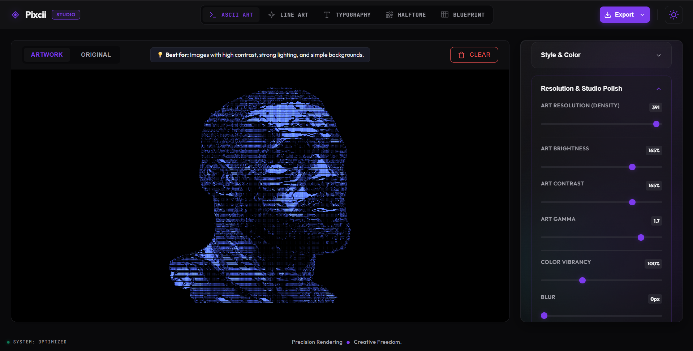

# ◈ Pixcii Studio

**Pixcii Studio** is a premium, high-fidelity generative art suite that runs entirely in your browser. Built with a **Glassmorphism 2.0** aesthetic, it transforms photos into stunning ASCII art, Technical Blueprints, Typographic Word Clouds, and Halftone patterns with professional-grade precision and real-time performance.

---

## ✨ Generative Engines

### 1. Blueprint & Schematic Mode (NEW)
Turns your images into highly precise technical engineering drawings.
- **Edge Detection**: Uses Sobel operators to extract stark object contours with adjustable threshold and line thickness.
- **Dynamic Elements**: Automatically generates measurement dimension brackets (`W: x`, `H: y`), geometric background grids, and technical crosshairs.
- **Annotation Densities**: Select from None, Minimal, Moderate, Dense, or Extreme plotting logic.
- **Architectural Themes**: Classic (Blueprint Blue), Matrix (Green/Black), Sepia, and Midnight (Dark Purple).

### 2. Canvas Typography Engine
A completely custom, high-resolution packing engine that paints your image using words.
- **Luminance Mapping**: Words dynamically scale and pack based on the darkness of the underlying image regions.
- **Advanced Controls**: Customize the word dictionary, font weight, global spacing, and letter spacing.

### 3. ASCII Art
- Detailed, Smooth, Block, and Terminal algorithms.
- Full control over character ramps and rendering density.

### 4. Line Art & Halftones
- **Line Art**: Minimalist threshold-based edge detection.
- **Halftone Patterns**: Professional dot layouts (Circle/Square) with customizable rotation and density spacing.

---

## 🎨 Global Studio Features

### 1. High-Fidelity Color Studio
- **Precision Picker**: Floating, sidebar-docked HSVA color picker.
- **Gradient Engine**: Support for **Linear** and **Radial** gradients with adjustable angles and color stops.
- **Edge Enhancements & Inversion**: Instantly invert output polarity or outline core structures.

### 2. Post-Processing & Transformations
- **Image Adjustments**: Fine-tune contrast, gamma, sharpness, blur, grain, and hue rotation in real-time.
- **Canvas Control**: Pad, rotate, and horizontally/vertically flip your output for precise layout alignment.

### 3. Persistence & Performance
- **Multi-threaded Generation**: All intensive math and edge-detection operations are offloaded to an isolated Web Worker (`art-worker.js`), ensuring the UI stays buttery smooth.
- **Session Recovery**: Every single slider adjustment, theme preference, and uploaded image is saved automatically to `localStorage`. Refresh your tab anytime without losing your work.
- **Iconic Navigation**: Professional, minimalist vector icons for each generator mode, providing a Figma-grade creative workspace.
- **Live Engine Analytics**: A unique "Marching Pixels" status bar in the footer with a live "System: Optimized" indicator.
- **Double-Click Resets**: Fast, professional workflow allowing instant slider resets to default values.

### 4. Professional Exporting
- **PNG**: High-resolution, pixel-perfect raster export.
- **SVG**: Fully scalable vector exports containing exact geometrical layouts.

---

## 💻 Local Setup

1. Clone the repository.

   `git clone https://github.com/MeetGhelani/Pixcii-studio.git`

2. Install dependencies:
 
   npm install

3. Start the development server:

   npm run dev

---

## 🛠️ Technical Stack

- **Core**: Vanilla JavaScript & HTML5 Canvas
- **Processing**: `art-worker.js` (Web Workers)
- **Styling**: Glassmorphism 2.0 (Frosted glass with physical noise textures and light-catch borders)
- **Typography**: Editorial pairing of **Outfit** (UI) and **JetBrains Mono** (Technical Data)
- **Build Tool**: [Vite](https://vitejs.dev/)

---

Precision Rendering &bull; Creative Freedom.
